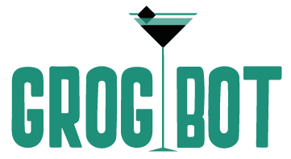

#  (API)
### About the GrogBot
The GrogBot App is a drink application that lets visitors choose a virgin ingredient which once submitted offers a list of drinks. The drinks show ingredients, instructions and type of glass. As the app is connected to a local Swedish liquor provider through an API you can also view a list of the liquors you can purchase in your local store, all Swedish brands of course.

### What would you need
This application has two repositories; the API (this one) and the client([here](https://github.com/kfrostare-Grogbot/team_2_grog_bot_client)). You will need to fork them both to get this App going.

### Installing
1. Fork this and [The Other](https://github.com/kfrostare-Grogbot/team_2_grog_bot_client) Git Repository
2. Install [Yarn](https://yarnpkg.com/) if you don't already have it
3. Install RSpec, Shoulda Matchers, Rack Cors and Webmock (links below for more on how to get these installed to your OS)
4. For deployment we recommend [Heroku](https://www.heroku.com/)

### Tested using
* [RSpec](https://rspec.info/)
* [Shoulda Matchers](https://matchers.shoulda.io/)
* [Rack Cors](https://www.rubydoc.info/gems/rack-cors/0.2.9)
* [Webmock](https://rubygems.org/gems/webmock)

### Built with
* [Ruby on Rails](https://rubyonrails.org/)
* [The Cocktail Database](https://www.thecocktaildb.com/)
* [The Systembolaget API](https://www.systembolaget.se/api/)

### Authors
* [Karolina Frostare](https://github.com/kfrostare)
* [Emma-Maria Thalén](https://github.com/emtalen)
* [Johan Bons](https://github.com/johanbounce)
* [Anish Kanwal](https://github.com/Anish2504)
* [Robin Lillqvist](https://github.com/robin-lillqvist)

### License
We operate under the MIT license.

### Thank you's
* The material needed to build this application was provided by [Craft Academy](https://www.craftacademy.se/english/)